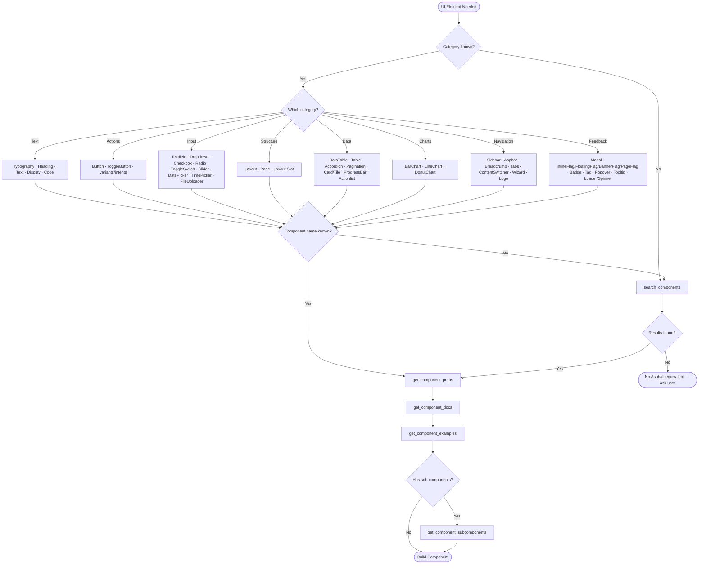

# Asphalt Component Decision Tree

**Use this file to pick a component from a UI need** — "a filterable
dropdown", "a dismissible inline error", "a sortable table". Each row maps an
intent to the component(s) to reach for. Once you've picked, get the import
from [COMPONENTS.md](./COMPONENTS.md) and verify props live via MCP/CLI
(`get_component_props`). Component names are **kebab-case**.

## Decision Matrix

```
UI element needed → category → specific component → verify via MCP/CLI
```

### 🔤 Text Display

`Typography` ships four sub-components: `Heading`, `Display`, `Code`,
`Text`. The `h1`–`h6` values are **boolean props on `Heading`**.
`Heading` has no `bold` prop (it is bold by design); `bold` lives on
`Text` only.

| If you need…           | Use                                   | Verify with                                                                |
| ---------------------- | ------------------------------------- | -------------------------------------------------------------------------- |
| Page / section heading | `<Heading h3>Title</Heading>`         | `get_component_props { component: "typography", subComponent: "Heading" }` |
| Body text              | `<Text>Body</Text>`                   | `get_component_props { component: "typography", subComponent: "Text" }`    |
| Hero / display text    | `<Display>Hero</Display>`             | `get_component_props { component: "typography", subComponent: "Display" }` |
| Code snippet           | `<Code>npm install …</Code>`          | `get_component_props { component: "typography", subComponent: "Code" }`    |
| Small muted label      | `<Text size="xs" muted span>…</Text>` | `get_component_props { component: "typography", subComponent: "Text" }`    |

### 🔘 Buttons & Toggles

Variants control emphasis (`primary | secondary | tertiary | nude`);
intents control meaning (`brand | danger | system`). Both groups are
mutually exclusive — set only one per group. `success` / `warning` are
**not** valid Button intents.

| If you need…                                 | Use                                                  |
| -------------------------------------------- | ---------------------------------------------------- |
| Primary action, CTA                          | `<Button primary>Save</Button>`                      |
| Cancel / alt, supporting                     | `<Button secondary>Cancel</Button>`                  |
| Subtle action                                | `<Button tertiary>Learn more</Button>`               |
| Least important action                       | `<Button nude>View</Button>`                         |
| Less recommended action, monochrome shades   | `<Button system>Next page</Button>`                  |
| Destructive                                  | `<Button primary danger>Delete</Button>`             |
| Icon-only                                    | `<Button icon nude aria-label="…"><Icon /></Button>` |
| Icon + label                                 | `<Button qualifier={<Icon />}>Save</Button>`         |
| Link styled as a button                      | `<Button link asProps={{ href: "/x" }}>…</Button>`   |
| UI-only on/off toggle, switch between states | `<ToggleButton on={x} onClick={…}>…</ToggleButton>`  |
| Monochrome without border                    | `<Button nude system>Go to page</Button>`            |

> Use `ToggleButton` only for UI-local toolbar state (filter pills,
> mute, view mode). For form state use `ToggleSwitch` / `Checkbox` /
> `Radio`.

### 📝 Form Inputs

| If you need…        | Use                                                     | Verify                                               |
| ------------------- | ------------------------------------------------------- | ---------------------------------------------------- |
| Text input          | `<Textfield placeholder="Name" />`                      | `get_component_props { component: "textfield" }`     |
| Numeric input       | `<Numeric placeholder="Enter number" />`                | `get_component_props { component: "textfield" }`     |
| Email               | `<Email stretch />`                                     | `get_component_props { component: "textfield" }`     |
| Password            | `<Password stretch />`                                  | `get_component_props { component: "textfield" }`     |
| Search field        | `<Search stretch placeholder="Search…" />`              | `get_component_props { component: "textfield" }`     |
| Phone number        | `<PhoneNumber stretch />`                               | `get_component_props { component: "textfield" }`     |
| PIN / OTP           | `<Pinfield length={6} />`                               | `get_component_props { component: "textfield" }`     |
| Transactional input | `<Hero placeholder="Rp" prefix="Rp" />`                 | `get_component_props { component: "textfield" }`     |
| Dropdown / select   | `<Dropdown items={items} />`                            | `get_component_props { component: "selection" }`     |
| Multi-select        | `<Dropdown items={items} multiSelect />`                | `get_component_props { component: "selection" }`     |
| Dropdown filter     | `<Dropdown items={items} typeahead />`                  | `get_component_props { component: "selection" }`     |
| Dropdown group      | `<Dropdown items={items} group />`                      | `get_component_props { component: "selection" }`     |
| Checkbox group      | `<Checkbox label="Email" checked={…} onChange={…} />`   | `get_component_props { component: "checkbox" }`      |
| Radio group         | `<Radio name="x" value="a" checked={…} onChange={…} />` | `get_component_props { component: "radio" }`         |
| On/off (form)       | `<ToggleSwitch on={x} onToggle={({on}) => …} />`        | `get_component_props { component: "toggle-switch" }` |
| Range slider        | `<Slider min={0} max={100} value={x} onChange={…} />`   | `get_component_props { component: "slider" }`        |
| Date / range        | `<DatePicker value={date} onChange={…} />`              | `get_component_props { component: "date-picker" }`   |
| Time / range        | `<TimePicker value={[date]} onChange={…} />`            | `get_component_props { component: "time-picker" }`   |
| File upload         | `<FileUploader drop multiple onChange={…} />`           | `get_component_props { component: "file-uploader" }` |

### 📐 Layout

`Layout` is **the** grouping primitive — use it for page skeletons,
toolbars, button bars, tag lists, avatar groups, everything. `gap` is
`"s" | "m" | "l"` (default `"m"`) — no `xs` / `xl`. There is no
separate `Grid` component, and **`@asphalt-react/stack` is deprecated**.

| If you need…    | Use                                                            | Verify                                        |
| --------------- | -------------------------------------------------------------- | --------------------------------------------- |
| Horizontal row  | `<Layout gap="s">…</Layout>`                                   | `get_component_props { component: "layout" }` |
| Vertical column | `<Layout vertical gap="s">…</Layout>`                          | `get_component_props { component: "layout" }` |
| Loose vertical  | `<Layout vertical gap="m">…</Layout>` (or `gap="l"`)           | `get_component_props { component: "layout" }` |
| Page skeleton   | `<Page><Page.Header/><Page.Aside/><Page.Main/>…</Page>`        | `get_component_props { component: "layout" }` |
| Sidebar + main  | `<Page><Page.Aside><Sidebar/></Page.Aside><Page.Main/></Page>` | `get_component_props { component: "layout" }` |
| Equal columns   | `<Layout fill s={2} m={4}>…</Layout>`                          | `get_component_props { component: "layout" }` |
| Named-area grid | `<Layout template={tpl}><Layout.Slot area="…" />…</Layout>`    | `get_component_props { component: "layout" }` |
| Space between   | `<Layout spread>…</Layout>`                                    | `get_component_props { component: "layout" }` |
| Aligned cluster | `<Layout placement="center" gap="s">…</Layout>`                | `get_component_props { component: "layout" }` |

### 📊 Data Display

`@asphalt-react/card` exports both `Card` (static) and `Tile`
(interactive). `Tile` is a **top-level named export**, not `Card.Tile`.

| If you need…           | Use                                                                             | Verify                                              |
| ---------------------- | ------------------------------------------------------------------------------- | --------------------------------------------------- |
| Sortable table         | `<DataTable header={h} data={d} identifier="id" autoPaginate />`                | `get_component_props { component: "data-table" }`   |
| Hand-rolled table      | `<Table><TableHead><TableHeadRow><TableHeadCell/>…</TableHeadRow></TableHead>…` | `get_component_props { component: "table" }`        |
| Card container         | `<Card>…</Card>`                                                                | `get_component_props { component: "card" }`         |
| Selectable card        | `<Tile as="button" onClick={…}>…</Tile>`                                        | `get_component_props { component: "card" }`         |
| Single Selectable card | `<Tile as="div" onClick={…}><Radio>...</Radio></Tile>`                          | `get_component_props { component: "card" }`         |
| Multi Selectable card  | `<Tile as="div" onClick={…}><Checkbox>...</Checkbox></Tile>`                    | `get_component_props { component: "card" }`         |
| Progress (0–100)       | `<ProgressBar value={50} />`                                                    | `get_component_props { component: "progress-bar" }` |
| Collapsible FAQ        | `<Accordion><AccordionHeader/><AccordionDescription/></Accordion>`              | `get_component_props { component: "accordion" }`    |
| Pagination             | `<Pagination totalPages={n} active={p} onChange={fn} />`                        | `get_component_props { component: "pagination" }`   |
| Action menu list       | `<Actionlist><Action onClick={…}>Edit</Action>…</Actionlist>`                   | `get_component_props { component: "actionlist" }`   |

### 📈 Charts

`@asphalt-react/data-viz` exposes three chart types — no plain
`Chart`. Size the wrapping `<div>`; do not put `className`/`style` on
the chart. There is no built-in pie, scatter, area, or heatmap — stop
and ask the user if you need one.

| If you need…                                 | Use                                             | Verify                                          |
| -------------------------------------------- | ----------------------------------------------- | ----------------------------------------------- |
| Categorical / grouped / stacked / horizontal | `<BarChart data={…} dataKey="…" />`             | `get_component_props { component: "data-viz" }` |
| Trend over time, multi-series                | `<LineChart data={…} dataKey="…" showPoints />` | `get_component_props { component: "data-viz" }` |
| Part-of-whole, small set of arcs             | `<DonutChart data={…} />`                       | `get_component_props { component: "data-viz" }` |

See [charts.md](./charts.md) for the full guide.

### 🧭 Navigation

`@asphalt-react/tab` exports `Tabs`, `TabList`, `TabItem`,
`TabItemIcon`, `TabPanel` (no plain `Tab`). `Breadcrumb` takes a
`crumbs` array of React nodes — not `items`. `Sidebar` / `Appbar`
accept `head` and `tail` as **props**, not children.

| If you need…           | Use                                                                                                          | Verify                                                  |
| ---------------------- | ------------------------------------------------------------------------------------------------------------ | ------------------------------------------------------- |
| Sidebar nav            | `<Sidebar head={<Logo />}><Nav><NavItem><NavLink>…</NavLink></NavItem></Nav></Sidebar>`                      | `get_component_props { component: "sidebar" }`          |
| Top app bar            | `<Appbar head={<Logo />}><Nav>…</Nav></Appbar>`                                                              | `get_component_props { component: "appbar" }`           |
| Breadcrumb             | `<Breadcrumb crumbs={[<Crumb><CrumbLink>…</CrumbLink></Crumb>, …]} />`                                       | `get_component_props { component: "breadcrumb" }`       |
| Tabs                   | `<Tabs><TabList><TabItem active>…</TabItem></TabList><TabPanel active>…</TabPanel></Tabs>`                   | `get_component_props { component: "tab" }`              |
| Switch alternate views | `<ContentSwitcher><Switch active>…</Switch></ContentSwitcher>`                                               | `get_component_props { component: "content-switcher" }` |
| Step indicator         | `<Wizard><Step active><StepIndicator/><StepContent><StepLabel/></StepContent></Step><WizardPath/>…</Wizard>` | `get_component_props { component: "wizard" }`           |
| Product logo           | `<Logo product="GoFood" symbol={<GoFood />} />`                                                              | `get_component_props { component: "logo" }`             |

### 💬 Feedback & Overlays

`@asphalt-react/flag` exports four variants — there is no plain
`<Flag>`. Pick `InlineFlag`, `FloatingFlag`, `BannerFlag`, or
`PageFlag` and pass an intent (`info | success | warning | danger | neutral`,
plus `invalid` on `InlineFlag`). `Badge` takes a count/label as
children; semantic intents (`success`, etc.) live on `Flag` / `Tag`,
not on `Badge`. Use `useToast` hook together with `<FloatingFlag inverse>` to create a toast notification.

| If you need…    | Use                                                                        | Verify                                         |
| --------------- | -------------------------------------------------------------------------- | ---------------------------------------------- |
| Modal dialog    | `<Modal open onClose={fn}><Title/><Description/><Footer/></Modal>`         | `get_component_props { component: "modal" }`   |
| Inline alert    | `<InlineFlag invalid>Email is required</InlineFlag>`                       | `get_component_props { component: "flag" }`    |
| Toast           | `<FloatingFlag inverse title="Saved" success>Changes saved</FloatingFlag>` | `get_component_props { component: "flag" }`    |
| Page banner     | `<BannerFlag title="Notice" warning>…</BannerFlag>`                        | `get_component_props { component: "flag" }`    |
| Hero status     | `<PageFlag title="Welcome" neutral>…</PageFlag>`                           | `get_component_props { component: "flag" }`    |
| Count badge     | `<Badge>3</Badge>`                                                         | `get_component_props { component: "badge" }`   |
| Ribbon badge    | `<Ribbon>New</Ribbon>`                                                     | `get_component_props { component: "badge" }`   |
| Label / chip    | `<Tag success>Active</Tag>`                                                | `get_component_props { component: "tag" }`     |
| Click popover   | `<Popover open target={<Button>…</Button>} onOpenChange={set}>…</Popover>` | `get_component_props { component: "popover" }` |
| Hover tooltip   | `<Tooltip target={<Button>…</Button>}>Tooltip text</Tooltip>`              | `get_component_props { component: "popover" }` |
| Blocking loader | `<Loader size="l" />`                                                      | `get_component_props { component: "loader" }`  |
| Inline spinner  | `<Button primary disabled qualifier={<Spinner />}>Saving…</Button>`        | `get_component_props { component: "loader" }`  |

## Visual Decision Flow



## After You've Picked

Verify props with `get_component_props`, read the README with
`get_component_docs` for gotchas, and call `get_component_subcomponents` for
composite components (`sidebar`, `layout`, `card`, `wizard`). Implement with
semantic props only. If no Asphalt equivalent exists, **stop and ask** — don't
substitute plain HTML or a third-party library.

For naming/variant gotchas (`Tile` vs `Card.Tile`, the four `Flag` variants,
deprecated `Stack`, `Breadcrumb crumbs`, `Tabs` parts) and the full styling
rules, see **Critical Rules** and **Common Pitfalls** in
[SKILL.md](../SKILL.md).

## Example Decision Paths

**Need: "User profile card"**

```
1. Card container         → Card (or Tile if clickable)
2. Avatar                 → Avatar
3. Name                   → Text bold
4. Email                  → Text size="xs" muted
5. Vertical group         → Layout vertical gap="s"
6. MCP: get_component_docs { component: "card" }
7. MCP: get_component_docs { component: "avatar" }
```

**Need: "Data table with search & filters"**

```
1. Search bar             → Search (from textfield)
2. Filter pills           → ToggleButton group inside `<Layout gap="s">`
3. Table                  → DataTable with autoPaginate
4. Toolbar wrapper        → Layout spread
5. MCP: get_component_props { component: "textfield" }
6. MCP: get_component_props { component: "data-table" }
7. MCP: get_component_examples { component: "data-table" }
```

**Need: "Dashboard with sidebar + charts"**

```
1. Page structure         → Page, Page.Aside, Page.Main (from @asphalt-react/layout)
2. Sidebar                → Sidebar + Nav + NavItem + NavLink
3. KPI cards row          → Layout fill s={2} m={4}, each Card with Text + Heading
4. Charts                 → BarChart / LineChart / DonutChart, each in a sized div
5. Section titles         → Heading h3
6. MCP: get_component_docs { component: "sidebar" }
7. MCP: get_component_docs { component: "data-viz" }
8. MCP: get_component_props { component: "layout" }
```

**Need: "Multi-step form with validation"**

```
1. Wizard indicator       → Wizard + Step + WizardPath
2. Form per step          → Layout vertical gap="m"
3. Inputs                 → Textfield/Email + InlineFlag invalid below
4. Continue / Back        → Layout spread with two Buttons
5. Final submit           → Button primary with Spinner on submit
6. MCP: get_component_props { component: "wizard" }
7. MCP: get_component_props { component: "flag" }
8. MCP: get_component_examples { component: "textfield" }
```
